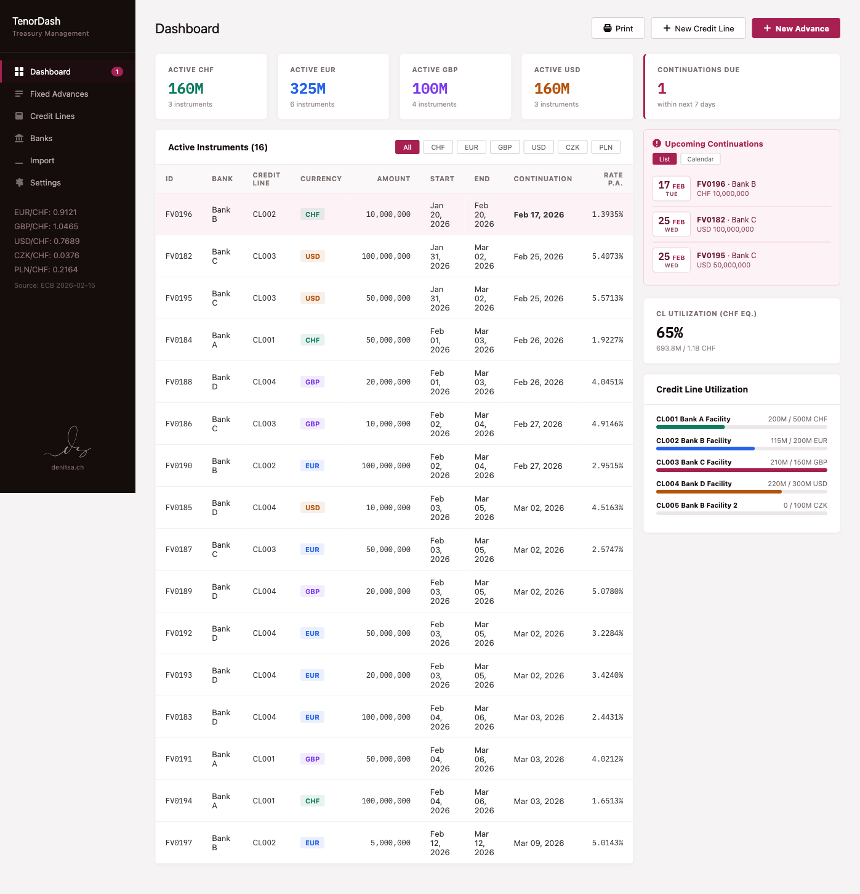
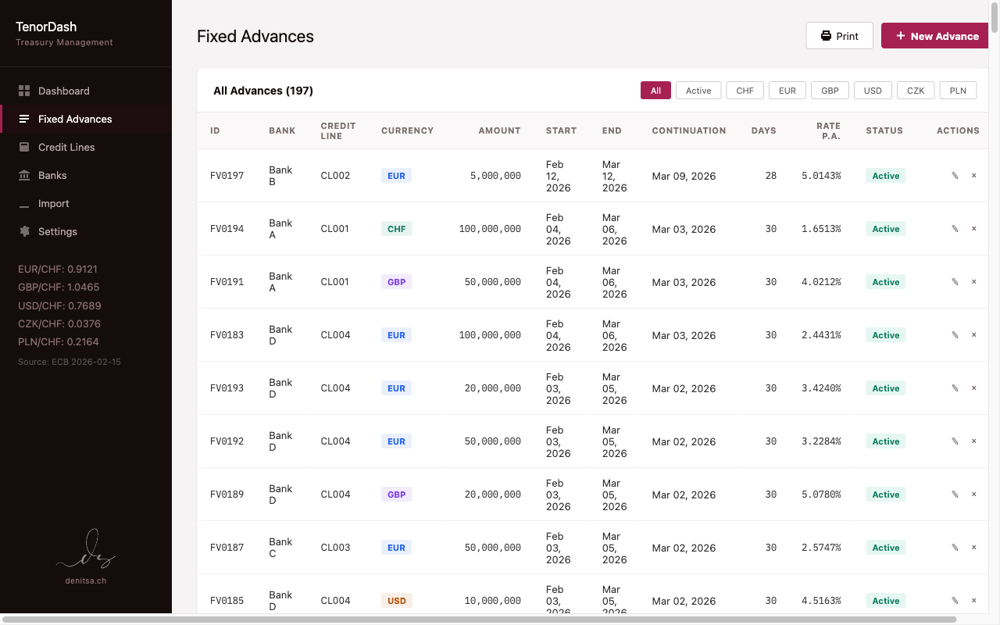
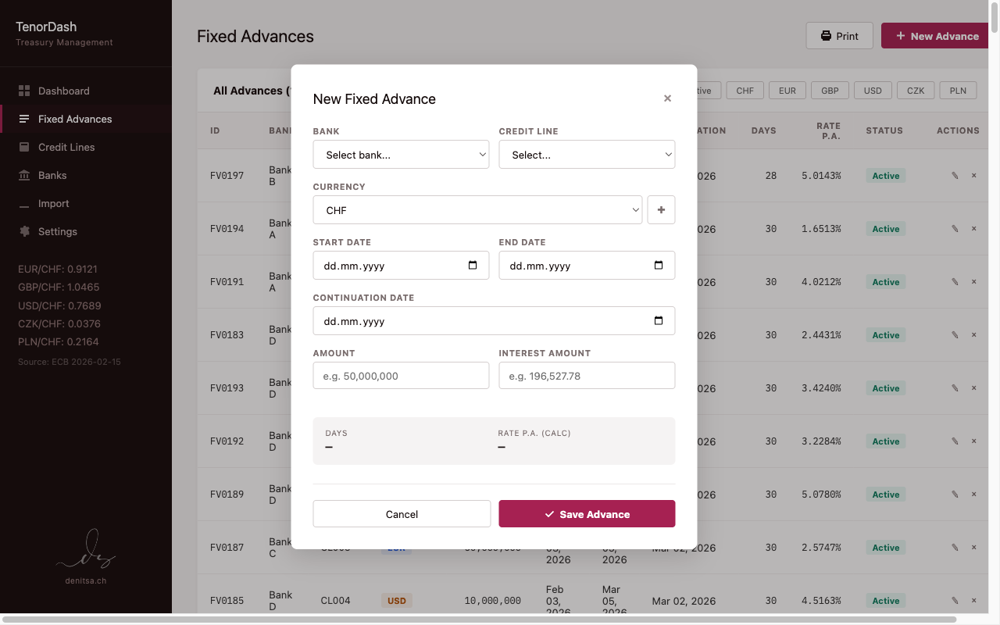
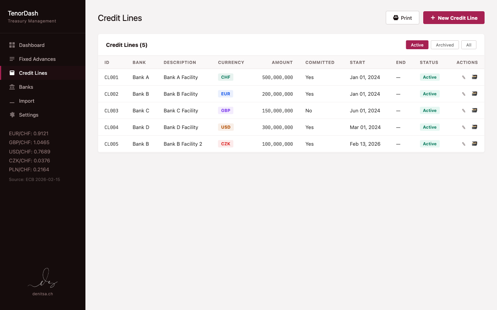

# TenorDash

A local Flask web app for tracking treasury fixed advance borrowings — replacing an Excel-based workflow with structured data entry, automatic calculations, and a dashboard with continuation date alerts.

## What It Does

- **Dashboard** — Active instruments at a glance, summary cards per currency, upcoming continuation alerts with list/calendar views and month navigation, credit line utilization bars with aggregate CHF equivalent
- **Fixed Advances CRUD** — Create, edit, delete borrowing drawdowns with auto-generated IDs (`FV0001`, `FV0002`, ...), live calculation preview (days, back-calculated interest rate), and credit line capacity warnings
- **Credit Lines** — Manage borrowing facilities with bank linkage, currency, committed status, soft delete (archive)
- **Banks** — Simple reference table for bank dropdowns
- **Dynamic Currency Management** — Add new currencies inline from any form via a "+" button; ECB validation, auto-assigned badge colors from a 12-color palette. Ships with CHF, CZK, EUR, GBP, PLN, USD; new currencies (e.g. JPY, SEK) can be added at any time
- **Continuation Date Auto-Suggest** — 3 business days before maturity, editable
- **ECB FX Rates** — Dynamically fetches cross rates from ECB Data API for all active currencies; displayed in the navigation sidebar on every page; cached daily with automatic cache reset when currencies change
- **Excel Import** — Import historical data from Excel files with preview, validation, and append/overwrite modes
- **Print / PDF Export** — Browser-native print with a dedicated print stylesheet (landscape, clean tables, FX rates footer)
- **Auto-Export for Power BI** — `.xlsx` export triggers automatically on every advance/credit line save; configurable export path via Settings
- **Settings** — Configurable display unit (full / thousands / millions), upcoming continuations display limit, and export path with folder browser
- **Locale-Aware Formatting** — Amount fields use the browser's locale for thousands/decimal separators

## Screenshots

### Dashboard
Summary cards, active instruments, continuation alerts, and credit line utilization — all on one page.



### Fixed Advances
Full list with currency filters, sortable columns, and inline status. The slide-out form shows live calculation preview.




### Credit Lines
Borrowing facilities with Active/Archived filtering and edit/archive actions.



## Tech Stack

- **Python / Flask** — backend and routing
- **SQLite** — embedded database (created at runtime)
- **Vanilla JS** — slide-out panels, filters, live calculations
- **No ORM** — raw parameterized SQL, 4 tables, <200 rows

## Getting Started

### Quick Launch (recommended)

**macOS:** Double-click `run-tenordash.command` in Finder.

**Windows:** Double-click `run-tenordash.bat` in Explorer.

The script will set up a virtual environment, install dependencies, open your browser, and start the server. Close the terminal window or press `Ctrl+C` to stop.

### Manual Setup

```bash
python3 -m venv .venv
source .venv/bin/activate        # macOS/Linux
# .venv\Scripts\activate.bat     # Windows
pip install -r requirements.txt
python3 app.py
```

Open http://127.0.0.1:5001 in your browser.

The database (`fixed_advances.db`) is created automatically on first run.

## Project Structure

```
├── app.py              # Flask routes, template filters, settings & currency API
├── db.py               # SQLite schema, migrations, queries
├── helpers.py          # Date math, interest rate calc, business-day logic
├── ecb.py              # ECB Data API client (dynamic currencies, daily cache)
├── export.py           # Auto-export .xlsx for Power BI (advances + credit lines)
├── import_utils.py     # Excel parser and validation for bulk import
├── config.py           # Paths, business rules, base currency
├── static/
│   ├── style.css       # Full UI styling (including @media print)
│   ├── app.js          # Settings modal, folder browser, shared handlers
│   └── logo.png        # Monogram
├── templates/
│   ├── base.html       # Sidebar layout, ECB rates, currency/settings modals
│   ├── dashboard.html  # Summary cards, alerts, continuations, instruments
│   ├── advances.html   # Advances list + slide-out form
│   ├── credit_lines.html
│   ├── banks.html
│   └── import.html     # Excel import with preview and validation
├── tests/
│   ├── test_api_contract.py          # Route/endpoint tests
│   ├── test_continuation_calendar.py # Calendar grid + navigation tests
│   ├── test_ecb.py                   # API resilience tests
│   ├── test_export.py                # .xlsx export tests
│   ├── test_helpers.py               # Business logic tests
│   ├── test_import.py                # Excel import tests
│   └── test_settings.py              # Settings API + display filter tests
└── TenorDash PRD.md  # Product requirements
```

## Business Logic

- **Interest rate**: Back-calculated as `interest_amount / amount_original × 360 / days` (360-day year convention). The interest amount is the input (provided by the bank), and the rate is derived for verification — this lets the user cross-check the bank's quoted rate against the actual interest charged
- **Active flag**: `start_date <= today < end_date`
- **Continuation date**: 3 business days before end date (weekends only, no holiday calendar)
- **IDs**: Auto-incremented with prefix — `FV0001` for advances, `CL001` for credit lines
- **CL capacity check**: On save, compares current drawn amount + new advance against the credit line facility; warns if exceeded but allows the user to proceed
- **Currencies**: Stored in a `currencies` table with code, CSS color, display order, and ECB availability flag. New currencies are validated against the ECB API on creation; non-ECB currencies are allowed but flagged
- **FX conversion**: ECB cross rates via EUR — dynamically builds the API URL from active currencies, converts to CHF per 1 unit of each currency; cached daily with automatic reset on currency changes
- **Auto-export**: `.xlsx` file written on every advance/credit line create, update, or delete; export path configurable in Settings; Power BI reads from this file

## Status

**v1.0.0** — All planned features are complete:

- Phase 1: Core CRUD + dashboard
- Phase 2: `.xlsx` auto-export for Power BI, settings
- Excel import from existing workbooks
- Print / PDF export via browser print
- Cross-platform launcher scripts (macOS + Windows)

## Release Process

- Use [RELEASE_CHECKLIST.md](RELEASE_CHECKLIST.md) before and after merging changes to `main`.

---

Created by [Denitsa Stachowski](https://denitsa.ch)
